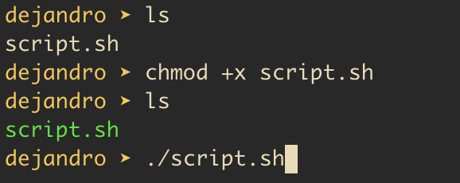

# nvidia-drivers-ubuntu
This script install nvidia driver on Ubuntu

1. Download the script
2. Make the script executable with the command
   chmod +x script.sh
3. Run the script
   ./script.sh

   

Note: if you experience "NVIDIA-SMI has failed because it couldn't communicate with the NVIDIA driver. Make sure that the latest NVIDIA driver is installed and running." error, please reboot your machine.
